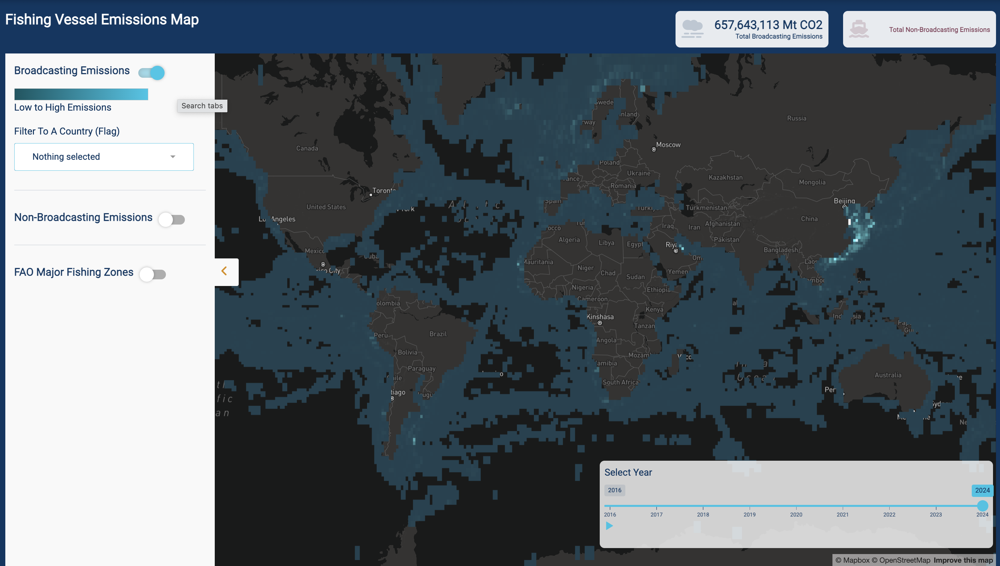

*UCSB MEDS 2025* - *Seamissions Capstone Team*

# Seafood Emissions Dashboard
**Link to Shiny App:** [https://emlab-ucsb.shinyapps.io/emissions-dashboard/](https://emlab-ucsb.shinyapps.io/emissions-dashboard/)



**Link to dashboard:** [https://emlab-ucsb.shinyapps.io/emissions-dashboard/](https://emlab-ucsb.shinyapps.io/emissions-dashboard/)

## About this repository:
This repository stores files for the interactive Seafood Emissions Dashboard that visualizes emissions related to global fishing fleets. It is a Shiny App Dashboard designed in R Studio. This app is designed in partnership with Global Fishing Watch (GFW) and the Environmental Markets Lab (EmLab). The app contains two primary tools:
1) **Fishing Vessel Emissions Map** An interactive web map (designed using Mapbox {mapdeck}) that allows users to visualize the global distribution of both AIS-broadcasting and non-broadcasting fishing vessel emissions.
2) **Seafood Emissions Explorer** An interactive app page that allows users to visualize a variety of plots including emissions per unit catch by 
 
**Content Overview**
This repo contains associated files for the Shiny App. The file is designed as a multi-file app.

The primary app files are:
- `global.R`: contains global settings used throughout the app
- `server.R`
- `ui.R`

The supporting files are:
- `theme.R`: contains universal theme options for the app including color and font choices.
- a `www/images` folders contain images used in the app and the repo readme

```
emissions-dashboard
│   README.md
|   .gitignore
|   global.R
|   server.R
|   theme.R
|   ui.R
│
└───rsconnect/shinyapps.io/emlab-ucsb
│      └───shinyapps.io
│               └───emlab-ucsb
│                   │  emissions-dashboard.dcf
│              
└───www
│    └───images
│        │ full-map-preview.png
│        │ map-preview.png
│        │ home-image.png

*** Data files were not pushed to github
```

**Authors:**
- Carmen Hoyt (https://github.com/ceh58)
- Joshua Mull (https://github.com/llumj)
- Nicole Pepper(https://github.com/nicolelpepper)
- Stephen Carroll (https://github.com/stephenccodes)

